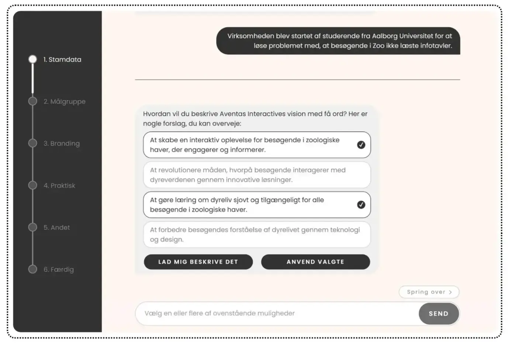

# Webapp for facilitating communication between designers and clients



## Setup

Install dependencies:

```bash
# bun
bun install
```

Add .env file with OPENAI_API_KEY in root folder.

## Start development server

```bash
# bun
bun run dev
```
